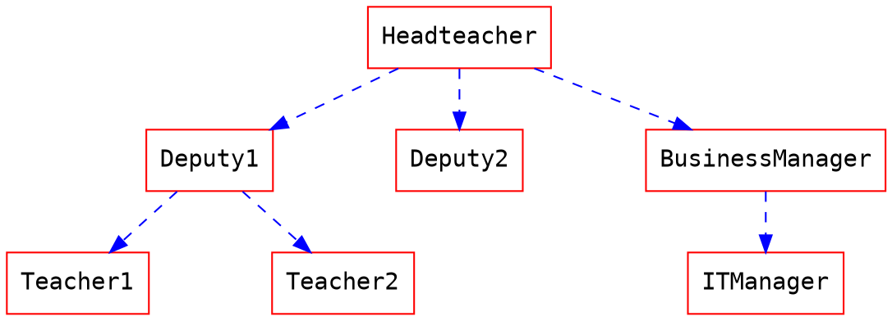
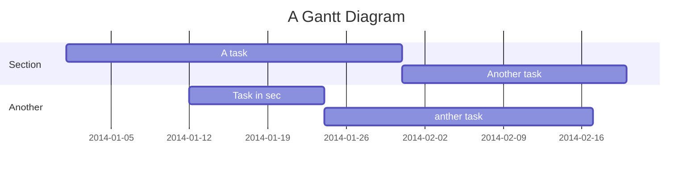

功能介紹
===

**[English version](/features)**
**[中文版](/features-tw)**
**[日本語版](/features-jp)**

**[:arrow_right: 看此筆記的原始碼 :arrow_left:](/features-tw?both)**

**[閱讀完整教學](https://hackmd.io/c/tutorials-tw)**

簡介
===
<i class="fa fa-file-text"></i> **HackMD** 是個跨平台的 Markdown 即時協作知識庫
您可以在**電腦、平板甚至是手機**與其他人協作筆記！

如有任何問題或是狀況，請至 [GitHub](https://github.com/hackmdio/hackmd-io-issues/issues/new) 回報問題
如果需要即時支援，請使用 [Facebook message](https://www.messenger.com/t/hackmdio)
**謝謝您！**

工作區
===
## 模式
**電腦 & 平板**

<i class="fa fa-pencil fa-fw"></i> 編輯：只看到編輯器
<i class="fa fa-eye fa-fw"></i> 檢視：只看到結果
<i class="fa fa-columns fa-fw"></i> 同時：同時看到兩邊

**手機**

<i class="fa fa-eye fa-fw"></i> 檢視：只看到結果
<i class="fa fa-pencil fa-fw"></i> 編輯：只看到編輯器

## 上傳圖片
只要按下這個按鈕 <i class="fa fa-camera"></i>
或是 **拖放** 圖片到編輯器，甚至 **貼上** 圖片也可以喔！
這會自動上傳圖片至 **[imgur](http://imgur.com)**，啥都不必煩惱了 :tada:


:::info
:bulb: **提示**: 如您使用私有團隊方案，圖片會上傳到私有的 S3 空間，且只能透過筆記存取圖片。
:::

## 分享筆記
按下選單右上角的分享按鈕 <i class="fa fa-share-alt"></i>，然後再按 **複製** 按鈕將筆記網址複製到您的剪貼簿

如果您想自訂筆記的固定網址，請閱讀 **[用固定網址發布筆記](https://hackmd.io/c/tutorials-tw/%2Fs%2Fhow-to-share-note-tw)**

## 儲存
目前可以儲存至 **Dropbox** <i class="fa fa-dropbox"></i>、**Google Drive**、**Gist <i class="fa fa-github"></i>** 或是存放 **.md** <i class="fa fa-file-text"></i> 到您的本機

## 匯入
就像上面的儲存功能，您可以從 **Dropbox** <i class="fa fa-dropbox"></i>、**Google Drive**、**Gist <i class="fa fa-github"></i>** 匯入 **.md** <i class="fa fa-file-text"></i>
或是從 **剪貼簿** <i class="fa fa-clipboard"></i> 匯入，而且這可以轉換 **HTML** 喔 :smiley:

## 權限
請按選單右上角的分享按鈕 <i class="fa fa-share-alt"></i>，按下之後您會看到分享選單

對於筆記的 **可閱讀**、**可編輯** 權限，您可以選擇：**擁有者**、**已登入者**、**所有人**

對於筆記的 **留言** 權限，請先在分享選單中按 **更多設定** 的按鈕，您可以選擇：**不開放留言**、**擁有者**、**已登入者**、**所有人**
您也可以透過留言選項右上角的 開關 <i class="fa fa-toggle-on"></i> ，直接關閉留言功能

**只有筆記的擁有者可以更改權限**

若要邀請特定使用者到某篇筆記，請閱讀 **[如何邀請其他人](https://hackmd.io/c/tutorials-tw/%2Fs%2Finvite-tw)**

## 嵌入
筆記可以使用 iframe 被嵌入，如下：
```xml
<iframe width="100%" height="500" src="https://hackmd.io/features" frameborder="0"></iframe>
```

或是您也可以使用嵌入語法來無縫引用筆記，請閱讀 **[在筆記中嵌入另一篇筆記](https://hackmd.io/c/tutorials-tw/%2Fs%2Fhow-to-embed-note-tw)**

## [簡報模式](/slide-example)
您可以使用一些語法將您的筆記分成投影片
然後用 **簡報模式** <i class="fa fa-tv"></i> 來展示，詳細請至上連結

## [書籍模式](/book-example)
您可以將您的筆記彙整成一本書
請將您的筆記連結列成清單
然後用 **書籍模式** <i class="fa fa-book"></i> 來展示，詳細請至上連結

檢視
===
## 目錄
請您看檢視區塊的右下角，有個 _目錄_ 的小按鈕 <i class="fa fa-bars"></i>
按下它會顯示目前的 _目錄_，而且會標明您所在的區塊
如果檢視區塊寬度足夠，目錄就會直接在檢視區塊的右方展開

目前支援顯示到 **第三階段的標題**

## 標題連結
每個標題都會在左側自動加上連結
您可以在滑到上面並且按 <i class="octicon octicon-link"></i> 移到那個錨點

編輯
===
## 快速鍵
跟又快又方便的 Sublime text 很像
> 更多訊息請至 [這裡](https://codemirror.net/demo/sublime.html)

## 自動完成
提供完整的 Markdown 自動完成與提示
- 表情符號：輸入 `:` 顯示提示
- 程式碼區塊：輸入 ` ``` ` 加上一個字元後顯示提示 <i style="display: none;">```</i>
- 標題：輸入 `#` 顯示提示
- 參考：輸入 `[]` 顯示提示
- 外部：輸入 `{}` 顯示提示
- 圖片：輸入 `!` 顯示提示

## 標題
會使用 **第一個第一級標題** 作為筆記標題

## 標籤
如同以下方式來使用標籤，它們會顯示在您的筆記列表
###### tags: `功能` `酷` `更新`

## [YAML metadata](/yaml-metadata)
提供描述筆記的資訊，以進階設定瀏覽行為，詳細請至上連結
- title: 設定筆記標題
- description: 設定筆記描述
- image: 設定筆記預設圖片 (用於連結預覽)
- tags: 設定筆記標籤
- robots: 設定網路機器人 meta
- lang: 設定瀏覽器顯示語言
- dir: 設定文字方向
- breaks: 設定是否使用分行
- GA: 設定 Google Analytics
- disqus: 設定 Disqus
- slideOptions: 設定簡報模式的選項

## ToC:
請使用此語法 `[TOC]` 將目錄嵌入到您的筆記之中

[TOC]

## 表情符號
您可以像是這樣使用表情符號 :smile: :smiley: :cry: :wink:
> 完整的表情符號列表 [在這裡](https://github.com/ikatyang/emoji-cheat-sheet)

## 待辦清單
- [ ] 待辦
  - [x] 買些沙拉
  - [ ] 刷牙
  - [x] 喝水

## 程式碼區塊
我們支援非常多程式語言，使用自動完成來看看有些什麼
```javascript=
var s = "JavaScript syntax highlighting";
alert(s);
function $initHighlight(block, cls) {
  try {
    if (cls.search(/\bno\-highlight\b/) != -1)
      return process(block, true, 0x0F) + 
             ' class=""';
  } catch (e) {
    /* handle exception */
  }
  for (var i = 0 / 2; i < classes.length; i++) {
    if (checkCondition(classes[i]) === undefined)
      return /\d+[\s/]/g;
  }
}
```
> 如果想要 **行號**，在表明程式語言之後輸入 `=`
> 您也可以指定開始行號，如下所示，行號從101開始

```javascript=101
var s = "JavaScript syntax highlighting";
alert(s);
function $initHighlight(block, cls) {
  try {
    if (cls.search(/\bno\-highlight\b/) != -1)
      return process(block, true, 0x0F) + 
             ' class=""';
  } catch (e) {
    /* handle exception */
  }
  for (var i = 0 / 2; i < classes.length; i++) {
    if (checkCondition(classes[i]) === undefined)
      return /\d+[\s/]/g;
  }
}
```

> 或是可以接續上一個程式碼區塊的行號，使用 `=+`

```javascript=+
var s = "JavaScript syntax highlighting";
alert(s);
```

> 有時候會有超長且沒有換行的文字，這時候使用 `!` 來將程式碼折行顯示

```!
When you’re a carpenter making a beautiful chest of drawers, you’re not going to use a piece of plywood on the back.
```

## 引用區塊標籤
> 您可以使用以下語法，表明自己的 **姓名、時間與顏色** 並與其他的引用區塊做區別
> [name=ChengHan Wu] [time=Sun, Jun 28, 2015 9:59 PM] [color=#907bf7]
> > 也支援巢狀引用區塊喔！
> > [name=ChengHan Wu] [time=Sun, Jun 28, 2015 10:00 PM] [color=red]

## 外部

### Youtube


### Vimeo


### Gist


### SlideShare


### Speakerdeck


### PDF
**注意：請使用 https 的網址，否則可能會被您的瀏覽器阻擋載入**


## MathJax

您可以使用 **MathJax** 語法 來產生 *LaTeX* 數學表達式，如同 [math.stackexchange.com](http://math.stackexchange.com/)，但是開始的 `$` 後面以及結尾的 `$` 前面不能有空白：

The *Gamma function* satisfying $\Gamma(n) = (n-1)!\quad\forall n\in\mathbb N$ is via the Euler integral

使用區塊層級的數學式時，請在您的數學式之前與之後給予 `$$` 以及換行：

$$
x = {-b \pm \sqrt{b^2-4ac} \over 2a}.
$$

$$
\Gamma(z) = \int_0^\infty t^{z-1}e^{-t}dt\,.
$$

> 更多關於 **LaTeX** 數學表達式 [請至這裡](http://meta.math.stackexchange.com/questions/5020/mathjax-basic-tutorial-and-quick-reference)

## UML 圖表

### 循序圖

您可以像是以下使用循序圖：

```sequence
艾莉絲->包柏: 哈摟，你好嗎？
Note right of 包柏: 包柏思考中
包柏-->艾莉絲: 我很好，謝謝！
Note left of 艾莉絲: 艾莉絲回應
艾莉絲->包柏: 最近過得怎樣？
```

### 流程圖

您可以像是以下使用流程圖：
```flow
st=>start: 開始
e=>end: 結束
op=>operation: 我的操作
op2=>operation: 啦啦啦
cond=>condition: 是或否？

st->op->op2->cond
cond(yes)->e
cond(no)->op2
```

### Graphviz


### Mermaid


### Abc
```abc
X:1
T:Speed the Plough
M:4/4
C:Trad.
K:G
|:GABc dedB|dedB dedB|c2ec B2dB|c2A2 A2BA|
GABc dedB|dedB dedB|c2ec B2dB|A2F2 G4:|
|:g2gf gdBd|g2f2 e2d2|c2ec B2dB|c2A2 A2df|
g2gf g2Bd|g2f2 e2d2|c2ec B2dB|A2F2 G4:|
```

### Vega-Lite
```vega
{
  "$schema": "https://vega.github.io/schema/vega-lite/v4.json",
  "data": {"url": "https://vega.github.io/editor/data/barley.json"},
  "mark": "bar",
  "encoding": {
    "x": {"aggregate": "sum", "field": "yield", "type": "quantitative"},
    "y": {"field": "variety", "type": "nominal"},
    "color": {"field": "site", "type": "nominal"}
  }
}
```

> 更多關於 **循序圖** 語法 [在這裡](http://bramp.github.io/js-sequence-diagrams/).
> 更多關於 **流程圖** 語法 [在這裡](http://adrai.github.io/flowchart.js/).
> 更多關於 **graphviz** 語法 [在這裡](http://www.tonyballantyne.com/graphs.html)
> 更多關於 **mermaid** 語法 [在這裡](http://mermaid-js.github.io/mermaid)
> 更多關於 **abc** 語法 [在這裡](http://abcnotation.com/learn)
> 更多關於 **vega** 語法 [在這裡](https://vega.github.io/vega-lite/docs)

警告區塊
---
:::success
耶 :tada:
:::

:::info
這是訊息 :mega:
:::

:::warning
注意 :zap:
:::

:::danger
喔不 :fire:
:::

:::spoiler 點選顯示更多內容
找到我了！ :stuck_out_tongue_winking_eye:
:::

:::spoiler {state="open"} 預設展開摺疊內容
找到我了！ :stuck_out_tongue_winking_eye:
:::


## 排版

### 標題

```
# h1 標題
## h2 標題
### h3 標題
#### h4 標題
##### h5 標題
###### h6 標題
```

### 水平分隔線

___

---

***


### 字形替換

(c) (C) (r) (R) (tm) (TM) (p) (P) +-

測試.. 測試... 測試..... 測試?..... 測試!....

!!!!!! ???? ,,

Remarkable -- awesome

"Smartypants, 雙引號"

'Smartypants, 單引號'

### 強調

**這是粗體文字**

__這是粗體文字__

*這是斜體文字*

_這是斜體文字_

~~這是刪除文字~~

上標： 19^th^

下標： H~2~O

++這是底線文字++

==這是標記文字==

{旁註標記|測試}

### 引用區塊


> 引用區塊也可以是巢狀的喔...
>> ...可以多層次的使用...
> > > ...或是用空白隔開 


### 清單

#### 項目

+ 在行開頭使用 `+` `-` 或是 `*` 來建立清單
+ 空兩個空白就可以產生子清單
  - 當清單標記使用的字元不同，會強制建立新的清單
    * Ac tristique libero volutpat at
    + Facilisis in pretium nisl aliquet
    - Nulla volutpat aliquam velit
+ 非常簡單！

#### 編號

1. Lorem ipsum dolor sit amet
2. Consectetur adipiscing elit
3. Integer molestie lorem at massa
1. 您可以逐次增加項目數字...

---

1. ...或是全部都使用 `1.`
1. feafw
2. 332
3. 242
4. 2552
1. e2

從其他範圍開始編號清單

57. foo
1. bar

### 程式碼

行內 `程式碼`

縮排程式碼

    // Some comments
    line 1 of code
    line 2 of code
    line 3 of code


程式碼區塊

```
Sample text here...
```

語法標色

```javascript
var foo = function (bar) {
  return bar++;
};

console.log(foo(5));
```

### 表格

| 選項 | 描述 |
| ------ | ----------- |
| data   | path to data files to supply the data that will be passed into templates. |
| engine | engine to be used for processing templates. Handlebars is the default. |
| ext    | extension to be used for dest files. |

向右對齊

| 選項 | 描述 |
| ------:| -----------:|
| data   | path to data files to supply the data that will be passed into templates. |
| engine | engine to be used for processing templates. Handlebars is the default. |
| ext    | extension to be used for dest files. |

向左對齊

| 選項 | 描述 |
|:------ |:----------- |
| data   | path to data files to supply the data that will be passed into templates. |
| engine | engine to be used for processing templates. Handlebars is the default. |
| ext    | extension to be used for dest files. |

置中對齊

| 選項 | 描述 |
|:------:|:-----------:|
| data   | path to data files to supply the data that will be passed into templates. |
| engine | engine to be used for processing templates. Handlebars is the default. |
| ext    | extension to be used for dest files. |


### 連結
[連結文字](http://dev.nodeca.com)
[加上標題的連結文字](http://nodeca.github.io/pica/demo/ "標題文字！")
自動轉換連結 https://github.com/nodeca/pica


### 圖片


如同連結一般，圖片也可以用註腳語法
![Alt text][id]
使用參考，可以在稍後的文件中再定義圖片網址

[id]: https://octodex.github.com/images/dojocat.jpg  "The Dojocat"


使用指定的大小顯示圖片

### 註腳

註腳 1 連結[^first].
註腳 2 連結[^second].
行內註腳^[行內註腳的文字] 定義
重複的註腳參考[^second].

[^first]: 註腳 **也可以標記**
    還可以有很多段落
[^second]: 註腳 文字

### 定義清單

名詞 1

:   定義 1 快速連續項目

名詞 2 加上 *行內標記*

:   定義 2

        { 這些程式碼屬於 定義 2 的一部分 }

    定義 2 的第三段落

_緊密樣式：_

名詞 1
  ~ 定義 1

名詞 2
  ~ 定義 2a
  ~ 定義 2b

### 縮寫

這是 HTML 的縮寫範例
它會轉換 "HTML"，但是縮寫旁邊其他的部分，例如："xxxHTMLyyy"，不受影響

*[HTML]: Hyper Text Markup Language
